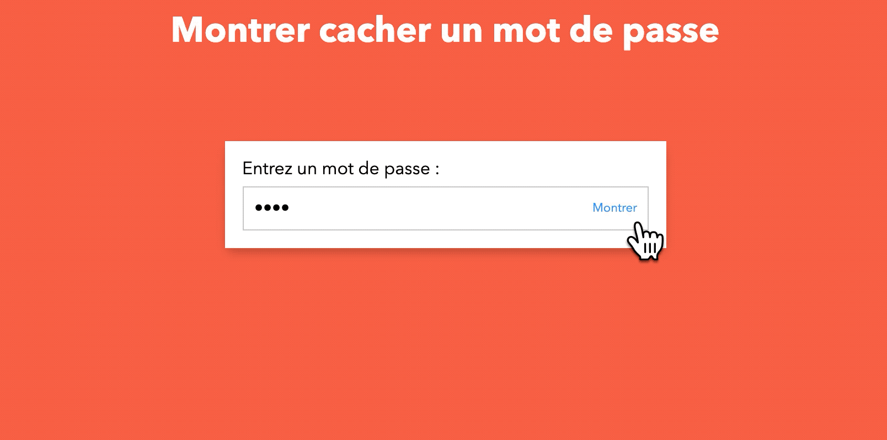

# Montrer cacher le mot de passe

> A JS exercise use at HEPL for DCC.

* * *

**js-tp-password** is an educational project, which will be used for `JS` courses.

**Note:** the school where the course is given, the [HEPL](http://www.provincedeliege.be/hauteecole) from Liège, Belgium, is a French-speaking school. From this point, the instruction will be in French. Sorry.

* * *

## Énoncé

Dans le cadre de cet exercice, nous vous demandons de montrer/cacher le mot de passe du champ mot de passe. 

## Aides

1. Écoutez le clic sur l'élément `.showPass`.
1. Changer le type de l'input de `password` vers `text`
1. Assurez de pouvoir retourner à l'état initial quand l'utilisateur clique une seconde fois.

